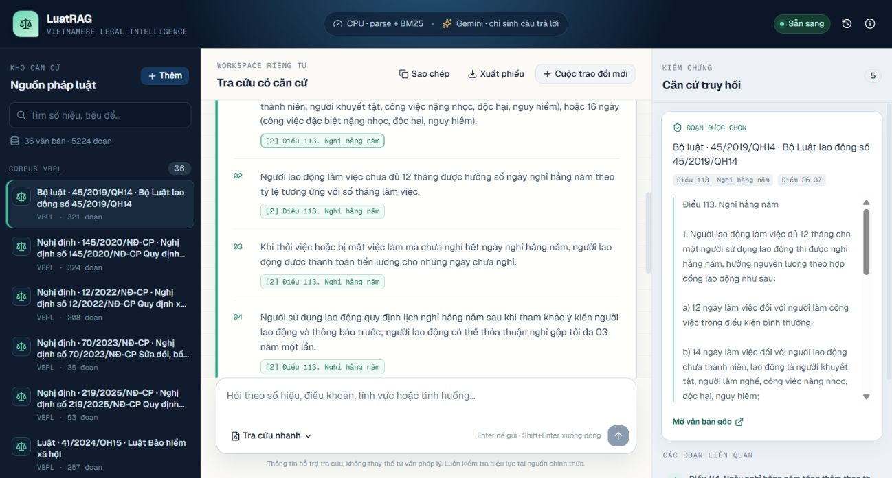
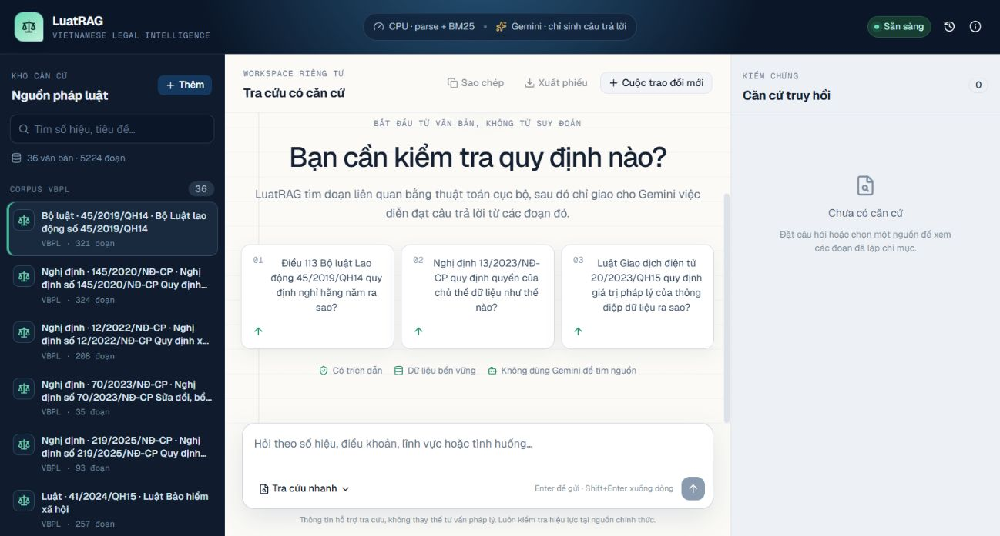
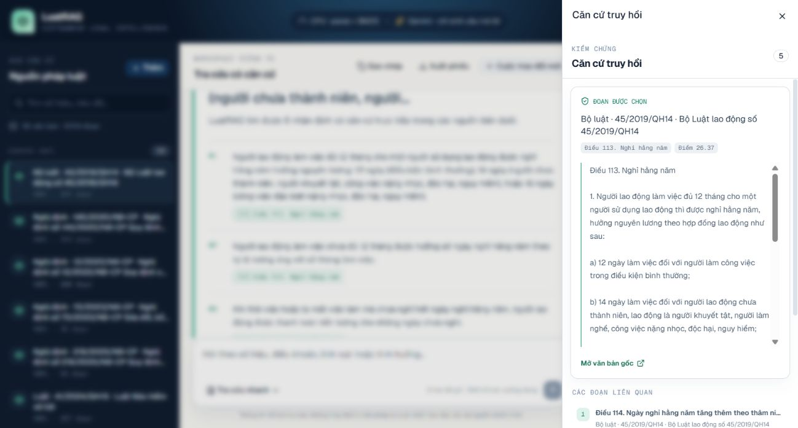
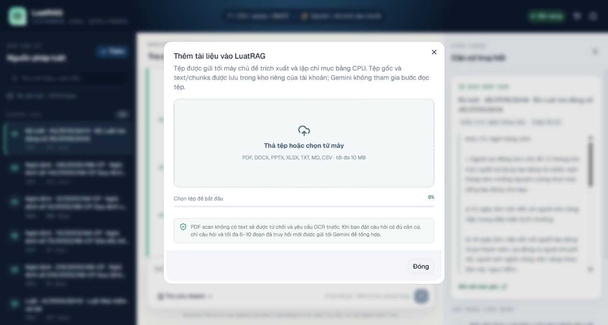
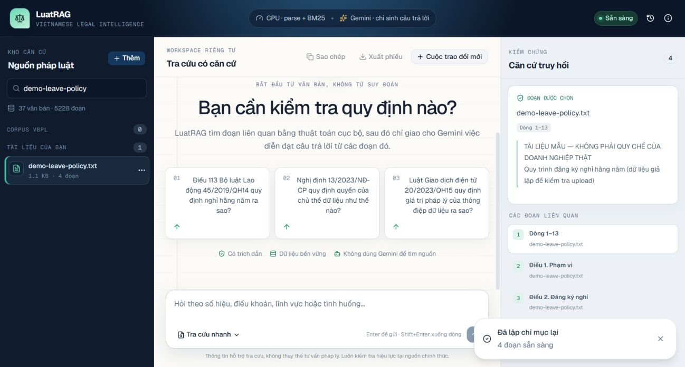
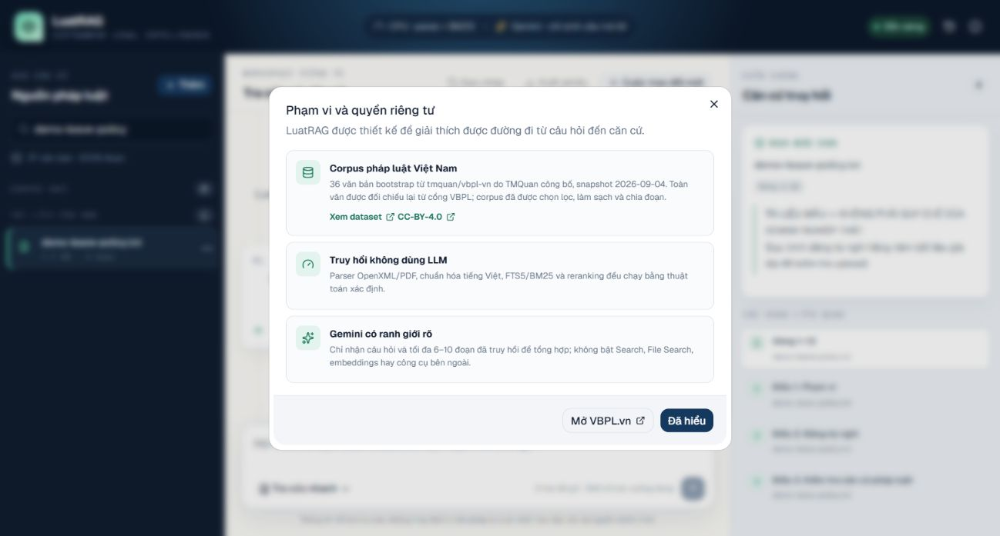

# LuatRAG

> Trợ lý tra cứu pháp luật Việt Nam có căn cứ, ưu tiên khả năng kiểm chứng hơn câu trả lời trôi chảy.

LuatRAG là một ứng dụng RAG end-to-end dành cho các nhóm pháp chế, nhân sự, tài chính và vận hành. Hệ thống tìm các đoạn liên quan trong corpus pháp luật và tài liệu nội bộ, chỉ gọi Gemini ở bước cuối để diễn đạt câu trả lời, rồi buộc từng nhận định phải trỏ về đúng đoạn nguồn đã truy hồi.

Đây không phải dịch vụ tư vấn pháp lý và corpus đi kèm chỉ là tập bootstrap được tuyển chọn. Với quyết định có hậu quả pháp lý, người dùng phải kiểm tra toàn văn, tình trạng hiệu lực và văn bản sửa đổi tại nguồn chính thức hoặc tham vấn chuyên gia đủ thẩm quyền.

## Ảnh chụp bản chạy thật bằng Docker

Các ảnh dưới đây được chụp trực tiếp trong browser Codex từ LuatRAG chạy bằng Docker Desktop trên Windows tại `http://localhost:3018`, ngày 18/09/2026. Frontend Next.js gọi backend Python/FastAPI qua mạng Docker; SQLite và tệp upload nằm trong volume `luatrag_luatrag_data`. Ảnh JPEG nguyên gốc nằm trong repository, không phụ thuộc link phiên chat, sandbox hoặc dịch vụ lưu ảnh bên ngoài. Không dùng mock response để tạo các ảnh này.

### Câu trả lời có trích dẫn và căn cứ cạnh bên

Tra cứu câu hỏi về Điều 113 Bộ luật Lao động `45/2019/QH14` bằng Gemini thật: 6 nhận định có citation từ 5 đoạn evidence. Chọn citation sẽ mở đúng đoạn nguồn để đối chiếu; kết quả vẫn có cảnh báo hiệu lực và giới hạn snapshot.



### Workspace tra cứu và kho căn cứ



### Kiểm chứng đến từng đoạn nguồn



### Upload và lập chỉ mục bằng Python



Tệp [demo-leave-policy.txt](docs/examples/demo-leave-policy.txt) chứa dữ liệu giả lập, không phải chính sách của doanh nghiệp thật. Tệp được chọn từ máy qua browser, backend trích xuất thành 4 đoạn; thao tác **Lập chỉ mục lại** thành công. Tổng kho lúc này là 37 nguồn / 5.228 đoạn, gồm 36 văn bản bootstrap và 1 tài liệu mẫu.



### Provenance và phạm vi dữ liệu gửi tới Gemini



### Những gì đã kiểm tra và chưa thể kết luận

| Kiểm tra thực tế | Kết quả |
| --- | --- |
| Hai container trên máy local | Backend healthy; frontend trả HTTP 200 và tải được workspace |
| Font giao diện | Geist được self-host bởi Next.js, có subset tiếng Việt; đã bỏ fallback serif ở tiêu đề |
| Corpus trước upload | 36 văn bản, 5.224 đoạn |
| Một câu hỏi công khai bằng Gemini | 6 nhận định có citation, 5 đoạn evidence; mở được citation Điều 113 |
| Upload TXT qua browser | Python trích xuất được 4 đoạn; tìm nguồn và đọc nội dung được |
| Reindex qua browser | Thành công, vẫn 4 đoạn |
| Upload/reindex/delete và từ chối thiếu căn cứ | Được kiểm tra thêm bằng smoke test HTTP qua frontend Docker |

Đây là kiểm tra chức năng, không phải benchmark chất lượng pháp lý, độ chính xác retrieval hoặc tải production. Chưa có số liệu đánh giá trên tập câu hỏi pháp lý chuẩn; citation hợp lệ không tự chứng minh rằng mọi nhận định đều đúng. Các định dạng PDF/OpenXML được kiểm thử bằng test tự động, không phải đều đã upload bằng browser trong lần chụp này. Corpus là snapshot, không được đồng bộ pháp luật liên tục; PDF scan chưa có OCR; production cần gateway xác thực riêng.

## Điểm chính

- Tra cứu tiếng Việt theo hai chế độ: **Nhanh** lấy tối đa 6 đoạn và **Sâu** lấy tối đa 10 đoạn.
- Backend Python/FastAPI: chuẩn hóa tiếng Việt, tách đoạn theo `Chương`/`Mục`/`Điều`, xếp hạng từ vựng xác định và SQLite FTS5/BM25 cho tài liệu người dùng.
- Evidence gate từ chối gọi LLM khi số hiệu, điều khoản hoặc mức độ khớp nội dung chưa đủ mạnh.
- Gemini Flash-Lite chỉ nhận câu hỏi cùng các đoạn đã truy hồi để tạo danh sách nhận định có cấu trúc; không dùng Gemini Search, File Search, embeddings, OCR hoặc parser.
- Citation fail-closed: mọi ID nguồn do model trả về phải thuộc tập evidence hiện hành; phản hồi sai schema, thiếu citation hoặc viện dẫn nguồn lạ sẽ bị từ chối.
- Corpus bootstrap có provenance từ [`tmquan/vbpl-vn`](https://huggingface.co/datasets/tmquan/vbpl-vn) và nội dung được làm mới từ cổng [VBPL của Bộ Tư pháp](https://vbpl.vn).
- Upload và lập chỉ mục thật cho PDF có text layer, DOCX, PPTX, XLSX, TXT, MD và CSV; PDF scan phải được OCR trước.
- SQLite lưu metadata, chunks, hội thoại, truy vết truy vấn và rate limit; kho tệp phía backend lưu bản gốc và kết quả trích xuất theo từng người dùng.
- Workspace ba vùng Sources / Conversation / Evidence, lịch sử tra cứu, mở nguồn chính thức, re-index, xóa nguồn và xuất câu trả lời Markdown.

## Luồng xử lý

```text
Tài liệu mặc định                  Tài liệu người dùng
JSON corpus đã kiểm tra            PDF/OpenXML/text parser Python trên server
        │                                      │
xếp hạng từ vựng                   kho tệp + SQLite FTS5/BM25
        └──────────────────┬───────────────────┘
                           ▼
                 retrieval + diversification
                           ▼
                    evidence gate
                   ┌───────┴────────┐
            không đủ căn cứ       đủ căn cứ
            trả lời từ chối       Gemini Flash-Lite
             không gọi LLM       structured claims
                   └───────┬────────┘
                           ▼
              kiểm tra citation + lưu SQLite
```

Corpus được xếp hạng trong backend Python bằng thuật toán xác định. Tài liệu người dùng được tìm bằng FTS5/BM25 trong SQLite rồi hợp nhất và đa dạng hóa với kết quả corpus. Không cần GPU và không có bước tạo vector embedding.

## Cấu trúc repository

Phân chia theo cùng mô hình với TradeMind: frontend độc lập, FastAPI backend, AI pipeline và công cụ Python ở root.

```text
backend/      FastAPI API, cấu hình bảo mật, storage và SQL migrations
frontend/     Next.js UI; src/app/api/[...path] chỉ làm BFF proxy
src/rag/      Python retrieval, chunking, evidence gate, Gemini, document parsing
data/         Corpus bootstrap; runtime local bị gitignore
scripts/      Python corpus builder, smoke test và import dữ liệu cũ
tests/        Pytest cho AI pipeline, HTTP API, persistence và migration
config/       Danh sách văn bản tuyển chọn và cấu hình tooling
docs/         Tài liệu/ảnh demo
```

## Chạy bằng Docker Desktop

Từ root repository, nếu chưa có `.env`, sao chép `.env.example` thành `.env` và điền `GEMINI_API_KEY` phía backend. Không ghi đè `.env` đã chứa khóa của bạn. Các cổng mặc định riêng của LuatRAG tránh đụng ứng dụng khác như TradeMind:

```dotenv
APP_ENV=development
WEB_PORT=3018
PORT=8018
FRONTEND_ORIGIN=http://localhost:3018
GEMINI_MODEL=gemini-3.1-flash-lite
```

```bash
docker compose up -d --build --wait
docker compose ps
```

Mở [LuatRAG local](http://localhost:3018). Health qua frontend tại `http://localhost:3018/api/health`; backend local tại `http://127.0.0.1:8018`. Trong mạng Docker, frontend dùng `http://backend:8000`, không dùng `localhost` để gọi container khác. Nếu đổi `WEB_PORT`, phải đổi `FRONTEND_ORIGIN` cho khớp.

Cả hai cổng chỉ bind loopback. `APP_ENV=development` cung cấp workspace local dùng chung, không phải đăng nhập hoặc phân quyền production. BFF chỉ cấp identity local khi cấu hình development và Host khớp origin loopback; production không có fallback này. Ứng dụng không cần chạy trong ChatGPT hoặc đăng nhập ChatGPT.

```bash
docker compose logs --tail 100
docker compose down
```

`down` dừng container nhưng giữ volume. Không dùng `down -v` nếu cần giữ tài liệu và hội thoại. Docker dùng volume `luatrag_luatrag_data` riêng; chạy Python trực tiếp dùng `data/runtime/`. Không trộn hai kho dữ liệu này nếu chưa sao lưu/chuyển dữ liệu.

## Chạy development không dùng Docker

Yêu cầu Python `>=3.12` và Node.js `>=22.13.0`. Chạy các lệnh đầu tiên từ root repo.

```bash
python -m venv .venv
# PowerShell: .\.venv\Scripts\Activate.ps1
# bash/zsh: source .venv/bin/activate
python -m pip install -r backend/requirements-test.txt
```

Nếu chưa có `.env`, sao chép `.env.example` thành `.env` ở root và điền khóa Gemini phía backend. Frontend có `frontend/.env.example` riêng để cấu hình `API_ORIGIN` và BFF secret.

```dotenv
GEMINI_API_KEY=your_server_side_key
GEMINI_MODEL=gemini-3.1-flash-lite
```

Không đặt khóa vào biến có tiền tố public, source code, commit, ảnh chụp hoặc log. Nếu một khóa từng xuất hiện ở nơi không tin cậy, hãy thu hồi và cấp khóa mới.

Đảm bảo `.env` root có `FRONTEND_ORIGIN=http://localhost:3018` trước khi khởi động backend. Frontend dùng `API_ORIGIN=http://127.0.0.1:8000` trong `frontend/.env.local` nếu cần. Backend tự áp dụng SQL migrations khi khởi động:

```bash
python -m uvicorn backend.main:app --reload --host 127.0.0.1 --port 8000
```

Frontend ở terminal khác:

```bash
cd frontend
npm ci
npm run dev -- --port 3018
```

Mở [LuatRAG local](http://localhost:3018). Backend chạy ở `http://127.0.0.1:8000`; OpenAPI development ở `/docs`. Không chạy development trên cùng cổng với stack Docker đang bật. Frontend gọi `/api/*` cùng origin qua BFF. `/api/health` kiểm tra SQLite, kho tệp và trạng thái Gemini nhưng không trả về secret.

## Dữ liệu pháp luật

Artifact `data/legal-corpus.json` được tạo bằng Python builder có giới hạn và checksum:

```bash
python -m scripts.fetch_legal_corpus
```

Lệnh này cần kết nối mạng. Builder kiểm tra revision của repository dữ liệu, lấy một danh sách văn bản được tuyển chọn từ gateway công khai VBPL, chuẩn hóa nội dung, chia chunk theo cấu trúc pháp lý và ghi checksum/provenance vào manifest. Builder từ chối ghi đè nếu số tài liệu hoặc số chunk không đạt ngưỡng an toàn.

Tập đi kèm không đại diện cho toàn bộ hệ thống pháp luật Việt Nam. Dữ liệu phái sinh từ [`tmquan/vbpl-vn`](https://huggingface.co/datasets/tmquan/vbpl-vn), ghi công tác giả **TMQuan** theo [CC BY 4.0](https://creativecommons.org/licenses/by/4.0/), và đã được tuyển chọn, làm sạch, chuẩn hóa, chia đoạn cùng bổ sung metadata/checksum. Không có sự bảo trợ hoặc chứng nhận của TMQuan, Hugging Face, VBPL hay Bộ Tư pháp đối với LuatRAG.

## Upload tài liệu nội bộ

| Định dạng | Cách trích xuất | Giới hạn đáng chú ý |
| --- | --- | --- |
| TXT, MD, CSV | Giải mã UTF-8 trong backend Python | Tệp tối đa 10 MB |
| PDF | `pypdf`, chỉ đọc text layer | Tối đa 300 trang; PDF scan bị từ chối |
| DOCX | Đọc OpenXML trong ZIP | Tệp mã hóa hoặc ZIP bất thường bị từ chối |
| PPTX | Đọc text theo slide từ OpenXML | Không diễn giải hình ảnh/biểu đồ raster |
| XLSX | Đọc ô và shared strings từ OpenXML | Không tính lại công thức |

Trình duyệt gửi tệp gốc; backend Python tự trích xuất nội dung bằng CPU, kiểm tra giới hạn ZIP/XML/PDF, lưu tệp và ghi chunks vào SQLite. Backend không tin kết quả trích xuất do client gửi. Gemini chỉ nhận câu hỏi và tối đa 6–10 đoạn đã truy hồi cùng metadata cần thiết.

## API hiện có

| Endpoint | Chức năng |
| --- | --- |
| `GET /api/health` | Kiểm tra identity, SQLite, kho tệp và trạng thái cấu hình model |
| `POST /api/ask` | Retrieval, evidence gate, sinh câu trả lời và lưu query run |
| `GET/POST /api/sources` | Liệt kê hoặc tải nguồn của người dùng |
| `GET/DELETE /api/sources/:id` | Đọc evidence hoặc xóa nguồn cùng các hội thoại đã dùng nguồn đó |
| `POST /api/sources/:id/reindex` | Lập chỉ mục lại từ bản trích xuất trong kho tệp |
| `GET /api/conversations` | Liệt kê lịch sử hội thoại |
| `GET/DELETE /api/conversations/:id` | Đọc hoặc xóa một hội thoại |

Các mutation được kiểm tra origin ở cả BFF và backend. Development localhost sử dụng một identity cố định. Production yêu cầu `APP_ENV=production`, HTTPS `FRONTEND_ORIGIN`, BFF secret riêng tối thiểu 32 byte và identity từ gateway xác thực đáng tin cậy. Gateway phải xoá/ghi đè header `oai-authenticated-user-*` của client trước khi gửi tới frontend; repo không tự cung cấp màn hình đăng nhập. Backend production từ chối identity không đi kèm BFF secret hợp lệ. Secret chỉ cấu hình phía server, không dùng tiền tố public.

## Quality gates

```bash
python -m ruff check backend src scripts tests
python -m ruff format --check backend src scripts tests
python -m pytest
cd frontend
npm run lint
npm run typecheck
npm test
npm run format:check
npm run build
```

Pytest bao phủ retrieval tiếng Việt, evidence gate, hợp đồng citation Gemini, parse tài liệu Python, body streaming, tenant isolation, delete cascade, integrity corpus, import storage cũ và ảnh/link README. Frontend có test BFF riêng, gồm origin public khác cổng nội bộ Docker và identity local không được bật cho production. CI build rồi khởi động hai container thật và chạy smoke test qua frontend, ngoài job kiểm tra frontend/backend riêng; không cần provider secret cho smoke test này.

Kiểm tra thêm một câu hỏi corpus công khai bằng khóa Gemini đã cấu hình:

```bash
python -m scripts.smoke_storage --base-url http://localhost:3018 --with-gemini
```

## Triển khai

Runtime hiện tại là FastAPI + Next.js, không còn build thành Cloudflare Worker. Dockerfile riêng cho frontend/backend và Docker Compose nằm ở root. Backend cần persistent volume cho SQLite và kho tệp; mô hình này dành cho một backend instance với đĩa bền vững, không phải filesystem tạm của serverless hoặc nhiều instance chia sẻ SQLite qua network filesystem.

Cấu hình `GEMINI_API_KEY` dưới dạng secret backend; frontend chỉ có `API_ORIGIN` và `LUATRAG_BFF_SECRET`. Production phải đặt gateway xác thực phía trước frontend, BFF secret khớp ở hai service và chỉ cho frontend/gateway tin cậy truy cập backend. Kiểm tra health, upload/reindex/delete và câu trả lời có citation trước khi đưa dữ liệu nhạy cảm vào hệ thống.

### Chuyển dữ liệu local từ runtime cũ

Script import giữ nguyên snapshot Wrangler và từ chối ghi đè database đích:

```bash
python -m scripts.migrate_legacy_storage --state-path /path/to/wrangler/state/v3
```

Script dùng SQLite backup để giữ dữ liệu WAL và chuyển các blob R2 được tham chiếu sang kho tệp Python. Corpus bootstrap không cần chuyển đổi hoặc rebuild.

## License

Mã nguồn LuatRAG được phát hành theo MIT — xem [LICENSE](LICENSE). Corpus dùng dữ liệu phái sinh theo CC BY 4.0 như ghi rõ ở phần Dữ liệu pháp luật; dependencies Python/JavaScript khai báo trong `pyproject.toml` và `frontend/package-lock.json` vẫn tuân theo license riêng.
